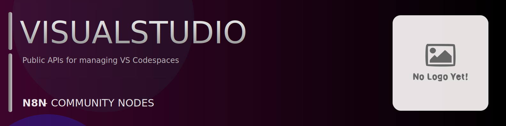

# @n8n-dev/n8n-nodes-visualstudio



[](https://www.npmjs.com/package/@n8n-dev/n8n-nodes-visualstudio)
[](https://opensource.org/licenses/MIT)

---

**Stop writing visualstudio API integrations by hand.**

Every time you connect n8n to visualstudio, you waste hours mapping endpoints, defining parameters, and debugging schemas. You copy-paste from docs, fix edge cases, and pray nothing breaks.

**What if connecting n8n to visualstudio took 5 minutes, not half a day?**

This node gives you **28+ resources** out of the box: **Agent Telemetry**, **Agents**, **Environments**, **Billing**, **Configuration**, and 23 more: with full CRUD operations, typed parameters, and zero manual configuration.

---

## What You Get

- **Zero boilerplate**: Resources, operations, and fields are pre-configured and ready to use
- **Full CRUD**: Create, read, update, and delete support where the API allows it
- **Typed parameters**: No more guessing field types
- **Built-in auth**: API key authentication, ready to go
- **Declarative**: Native n8n performance, no custom execute() overhead

---

## Install

```bash
npm install @n8n-dev/n8n-nodes-visualstudio
```

**Or in n8n:**
1. **Settings → Community Nodes → Install**
2. Search: `@n8n-dev/n8n-nodes-visualstudio`
3. Click **Install**

---

## Quick Start

1. Install the node (above)
2. Add credentials: **visualstudio API** → paste your API key
3. Drag the **visualstudio** node into your workflow
4. Pick a resource → pick an operation → done.

That's it. No configuration files. No code. It just works.

---

## Resources

| Resource | Operations |
|----------|------------|
| Agent Telemetry | POST POST Api V 1 Agent Telemetry, POST POST Api V 1 Agent Telemetry Standalone |
| Agents | GET GET Api V 1 Agents |
| Environments | GET GET Api V 1 Environments, POST POST Api V 1 Environments, DELETE DELETE Api V 1 Environments, GET Get Environment Route, PATCH PATCH Api V 1 Environments, POST Update Environment Route, GET GET Api V 1 Environments Archive, POST POST Api V 1 Environments Archive, POST POST Api V 1 Environments Export, PATCH PATCH Api V 1 Environments Folder, GET GET Api V 1 Environments Heartbeattoken, POST POST Api V 1 Environments Notify, DELETE DELETE Api V 1 Environments Ports, PUT PUT Api V 1 Environments Ports, PATCH PATCH Api V 1 Environments Restore, PUT PUT Api V 1 Environments Secrets, POST POST Api V 1 Environments Shutdown, POST POST Api V 1 Environments Start, GET GET Api V 1 Environments State, GET GET Api V 1 Environments Updates, DELETE DELETE Api V 1 Geneva Actions Environments, GET GET Api V 1 Geneva Actions Environments, PUT PUT Api V 1 Geneva Actions Environments Archive, GET GET Api V 1 Geneva Actions Environments Archived Storage Sas, PUT PUT Api V 1 Geneva Actions Environments Shutdown, POST POST Api V 1 Geneva Actions Environments Upload Running Vm Logs |
| Billing | POST POST Api V 1 Geneva Actions Billing Resend, GET GET Api V 1 Geneva Actions Billing, GET GET Api V 1 Geneva Actions Billing State Changes, POST POST Api V 1 Geneva Actions Billing State Changes |
| Configuration | POST POST Api V 1 Geneva Actions Configuration, DELETE DELETE Api V 1 Geneva Actions Configuration, GET GET Api V 1 Geneva Actions Configuration |
| Pools | POST POST Api V 1 Geneva Actions Pools Change Resource Deletion Setting, POST POST Api V 1 Geneva Actions Pools Rotate Pool, POST POST Api V 1 Geneva Actions Pools, GET GET Api V 1 Pools Default |
| Prebuilds | POST POST Api V 1 Geneva Actions Prebuilds Pools Createorupdatesettings, POST POST Api V 1 Geneva Actions Prebuilds Pools Delete, POST POST Api V 1 Prebuilds Pools Instances, PUT PUT Api V 1 Prebuilds Pools Instances, GET Get Template Info Route, GET Get Prebuild Readiness Route |
| Privacy | POST POST Api V 1 Geneva Actions Privacy Refresh Profile Telemetry Properties |
| Resources | POST POST Api V 1 Geneva Actions Resources Under Investigation |
| Vnet Pool Definitions | DELETE DELETE Api V 1 Geneva Actions Vnet Pool Definitions, POST POST Api V 1 Geneva Actions Vnet Pool Definitions |
| Heart Beat | POST POST Api V 1 Heart Beat |
| Locations | GET GET Api V 1 Locations |
| Sas | GET GET Api V 1 Sas |
| Secrets | GET GET Api V 1 Secrets, POST POST Api V 1 Secrets, DELETE DELETE Api V 1 Secrets, PUT PUT Api V 1 Secrets |
| Tenant | DELETE DELETE Api V 1 Tenant, GET GET Api V 1 Tenant, PUT PUT Api V 1 Tenant |
| Tokens | POST POST Api V 1 Tokens Plans Delete All Codespaces, POST POST Api V 1 Tokens Plans Read All Codespaces, POST POST Api V 1 Tokens Plans Write Codespaces, POST POST Api V 1 Tokens Plans Write Delegates, PUT PUT Api V 1 Tokens Subscriptions Resource Groups Providers Plans, POST POST Api V 1 Tokens Subscriptions Resource Groups Providers Plans Delete All Codespaces, POST POST Api V 1 Tokens Subscriptions Resource Groups Providers Plans Delete All Environments, POST POST Api V 1 Tokens Subscriptions Resource Groups Providers Plans Read All Codespaces, POST POST Api V 1 Tokens Subscriptions Resource Groups Providers Plans Read All Environments, POST POST Api V 1 Tokens Subscriptions Resource Groups Providers Plans Write Codespaces, POST POST Api V 1 Tokens Subscriptions Resource Groups Providers Plans Write Delegates, POST POST Api V 1 Tokens Subscriptions Resource Groups Providers Plans Write Environments |
| Tunnel | GET GET Api V 1 Tunnel Port Info |
| User Subscriptions | DELETE DELETE Api V 1 User Subscriptions, POST POST Api V 1 User Subscriptions |
| Network Settings | PUT PUT Api V 1 Subscriptions Providers Git Hub Network Subscription Life Cycle Notification, POST POST Api V 1 Subscriptions Providers Git Hub Network Resource Read Begin, POST POST Api V 1 Subscriptions Resource Groups Providers Git Hub Network Resource Read Begin, DELETE DELETE Api V 1 Subscriptions Resource Groups Providers Git Hub Network, PATCH PATCH Api V 1 Subscriptions Resource Groups Providers Git Hub Network, PUT PUT Api V 1 Subscriptions Resource Groups Providers Git Hub Network, POST POST Api V 1 Subscriptions Resource Groups Providers Git Hub Network Resource Creation Completed, POST POST Api V 1 Subscriptions Resource Groups Providers Git Hub Network Resource Creation Validate, POST POST Api V 1 Subscriptions Resource Groups Providers Git Hub Network Resource Deletion Completed, POST POST Api V 1 Subscriptions Resource Groups Providers Git Hub Network Resource Deletion Validate, POST POST Api V 1 Subscriptions Resource Groups Providers Git Hub Network Resource Patch Completed, POST POST Api V 1 Subscriptions Resource Groups Providers Git Hub Network Resource Patch Validate |
| Plans | PUT PUT Api V 1 Subscriptions Providers Microsoft Codespaces Plans Subscription Life Cycle Notification, POST POST Api V 1 Subscriptions Providers Microsoft Codespaces Plans Resource Read Begin, PUT PUT Api V 1 Subscriptions Providers Microsoft VS Online Plans Subscription Life Cycle Notification, POST POST Api V 1 Subscriptions Providers Microsoft VS Online Plans Resource Read Begin, POST POST Api V 1 Subscriptions Resource Groups Providers Microsoft Codespaces Plans Resource Read Begin, PUT PUT Api V 1 Subscriptions Resource Groups Providers Microsoft Codespaces Plans, POST POST Api V 1 Subscriptions Resource Groups Providers Microsoft Codespaces Plans Delete All Codespaces, POST POST Api V 1 Subscriptions Resource Groups Providers Microsoft Codespaces Plans Delete All Environments, POST POST Api V 1 Subscriptions Resource Groups Providers Microsoft Codespaces Plans Read All Codespaces, POST POST Api V 1 Subscriptions Resource Groups Providers Microsoft Codespaces Plans Read All Environments, POST POST Api V 1 Subscriptions Resource Groups Providers Microsoft Codespaces Plans Read Delegates, POST POST Api V 1 Subscriptions Resource Groups Providers Microsoft Codespaces Plans Resource Creation Completed, POST POST Api V 1 Subscriptions Resource Groups Providers Microsoft Codespaces Plans Resource Creation Validate, POST POST Api V 1 Subscriptions Resource Groups Providers Microsoft Codespaces Plans Resource Deletion Validate, POST POST Api V 1 Subscriptions Resource Groups Providers Microsoft Codespaces Plans Resource Patch Completed, POST POST Api V 1 Subscriptions Resource Groups Providers Microsoft Codespaces Plans Resource Patch Validate, POST POST Api V 1 Subscriptions Resource Groups Providers Microsoft Codespaces Plans Write Codespaces, POST POST Api V 1 Subscriptions Resource Groups Providers Microsoft Codespaces Plans Write Delegates, POST POST Api V 1 Subscriptions Resource Groups Providers Microsoft Codespaces Plans Write Environments, POST POST Api V 1 Subscriptions Resource Groups Providers Microsoft VS Online Plans Resource Read Begin, PUT PUT Api V 1 Subscriptions Resource Groups Providers Microsoft VS Online Plans, POST POST Api V 1 Subscriptions Resource Groups Providers Microsoft VS Online Plans Delete All Codespaces, POST POST Api V 1 Subscriptions Resource Groups Providers Microsoft VS Online Plans Delete All Environments, POST POST Api V 1 Subscriptions Resource Groups Providers Microsoft VS Online Plans Read All Codespaces, POST POST Api V 1 Subscriptions Resource Groups Providers Microsoft VS Online Plans Read All Environments, POST POST Api V 1 Subscriptions Resource Groups Providers Microsoft VS Online Plans Read Delegates, POST POST Api V 1 Subscriptions Resource Groups Providers Microsoft VS Online Plans Resource Creation Completed, POST POST Api V 1 Subscriptions Resource Groups Providers Microsoft VS Online Plans Resource Creation Validate, POST POST Api V 1 Subscriptions Resource Groups Providers Microsoft VS Online Plans Resource Deletion Validate, POST POST Api V 1 Subscriptions Resource Groups Providers Microsoft VS Online Plans Resource Patch Completed, POST POST Api V 1 Subscriptions Resource Groups Providers Microsoft VS Online Plans Resource Patch Validate, POST POST Api V 1 Subscriptions Resource Groups Providers Microsoft VS Online Plans Write Codespaces, POST POST Api V 1 Subscriptions Resource Groups Providers Microsoft VS Online Plans Write Delegates, POST POST Api V 1 Subscriptions Resource Groups Providers Microsoft VS Online Plans Write Environments, POST POST Api V 1 Subscriptions Providers Microsoft Codespaces Plans Delete Delegates, POST POST Api V 1 Subscriptions Providers Microsoft VS Online Plans Delete Delegates |
| Pool | DELETE DELETE Api V 1 Tenant Pool, GET GET Api V 1 Tenant Pool, PATCH PATCH Api V 1 Tenant Pool, PUT PUT Api V 1 Tenant Pool |
| Pool Group | DELETE DELETE Api V 1 Tenant Pool Group, GET GET Api V 1 Tenant Pool Group, PATCH PATCH Api V 1 Tenant Pool Group, PUT PUT Api V 1 Tenant Pool Group |
| Vm | GET GET Api V 1 Tenant Pool Vm, DELETE DELETE Api V 1 Tenant Pool Vm, PUT PUT Api V 1 Tenant Pool Vm, POST POST Api V 1 Tenant Pool Vm Start, POST POST Api V 1 Tenant Pool Vm Stop |
| Prebuilds V | POST POST Api V 2 Prebuilds Delete, DELETE DELETE Api V 2 Prebuilds Repository Branch, POST POST Api V 2 Prebuilds Templates, GET Get Prebuild Readiness Skus Route, POST POST Api V 2 Prebuilds Templates Updatemaxversions, POST POST Api V 2 Prebuilds Templates Updatestatus |
| Health | GET GET Health |
| Netmon | GET GET Internal Netmon Correlation |
| Authentication | GET GET Tunnelauth, POST POST Tunnelauth |
| Warmup | GET GET Warmup |

---

## Why This Node?

**Without this node:**
- Hours of manual API integration
- Copy-pasting from visualstudio docs
- Debugging auth, pagination, error handling
- Maintaining your own client code

**With this node:**
- Install → configure → use. 5 minutes.
- Auto-generated from the official visualstudio OpenAPI spec
- Always up to date when the API changes
- Native n8n performance

---

## Auto-Generated
This node was auto-generated from the official **visualstudio** OpenAPI specification using
[@n8n-dev/n8n-openapi-node-ultimate](https://github.com/kelvinzer0/n8n-openapi-node-ultimate),
then validated against the live API so you get accurate types and real parameters, not guesswork.

When the visualstudio API updates, this node updates too.

---

## Support This Project

If this node saved you hours of work, consider supporting continued development, new APIs, better error handling, and faster updates.

[](https://n8n-code.github.io/membership/#/eyJ0aXRsZSI6IktlZXAgSXQgTW92aW5nIiwiZGVzYyI6Ik9uZSBkZXZlbG9wZXIgYnVpbHQgYSB0b29sIHRoYXQgYXV0by1nZW5lcmF0ZXNcbm44biBub2RlcyBmcm9tIGFueSBPcGVuQVBJIHNwZWMuXG5cbllvdXIgZG9uYXRpb24gZnVuZHMgbmV3IGZlYXR1cmVzLCBtb3JlIEFQSSBzdXBwb3J0LFxuYW5kIGJldHRlciB0b29saW5nIGZvciBldmVyeSBkZXZlbG9wZXIgYWZ0ZXIgeW91LiIsInRhcmdldCI6NTAwMCwiYWRkcmVzc2VzIjp7ImV0aGVyZXVtIjoiMHhmMDU1NWQ0MGRiRkI0ZTNCZjA3MDQ0MjgyQjc4RjJmRTFmNTFFZjcyIiwic29sYW5hIjoiNlpEVk5BYmpZZExEcXo4cGt3VUNHYllaNVV3QlFranB0QzU1Wk5vTFcybVUifSwiZGlzY29yZCI6Imh0dHBzOi8vZGlzY29yZC5nZy9wdERaOGU0aDkzIn0)

---

## License

MIT © [kelvinzer0](https://github.com/n8n-code)
